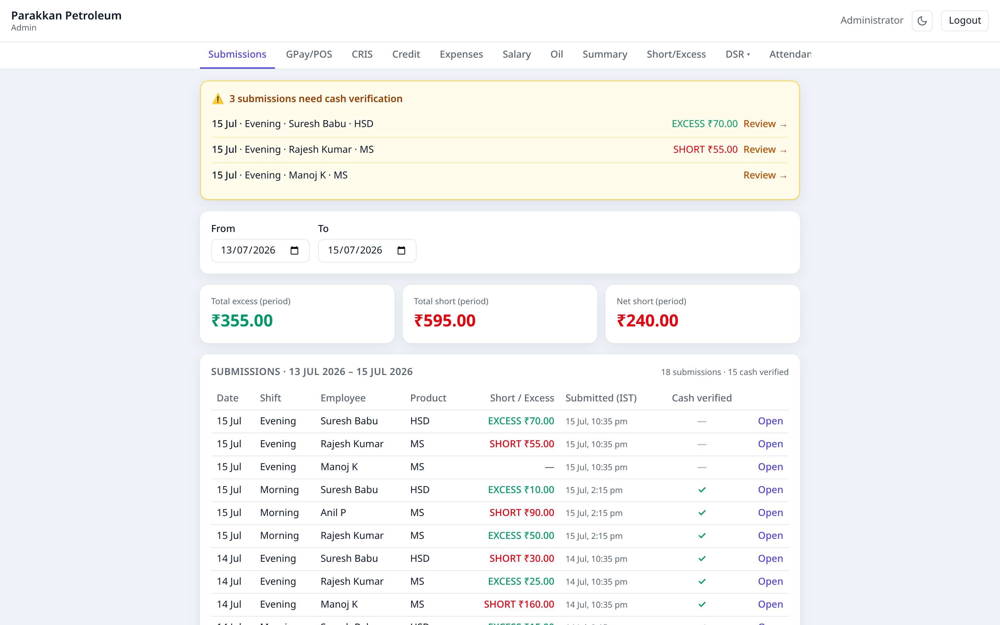
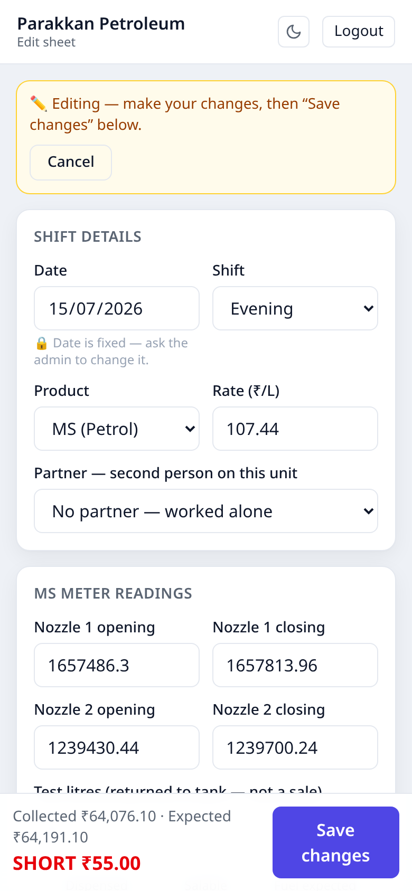
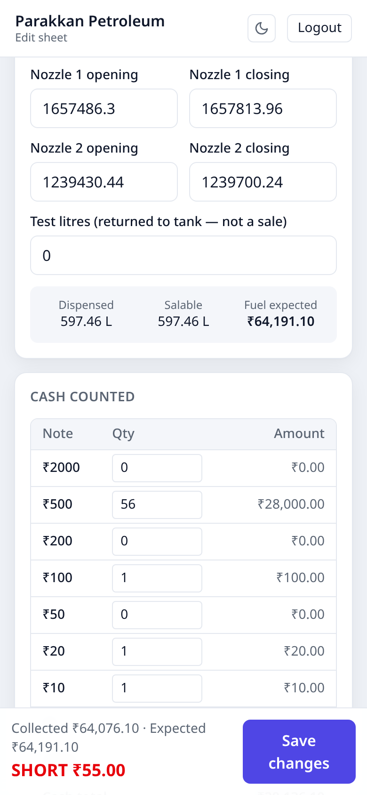
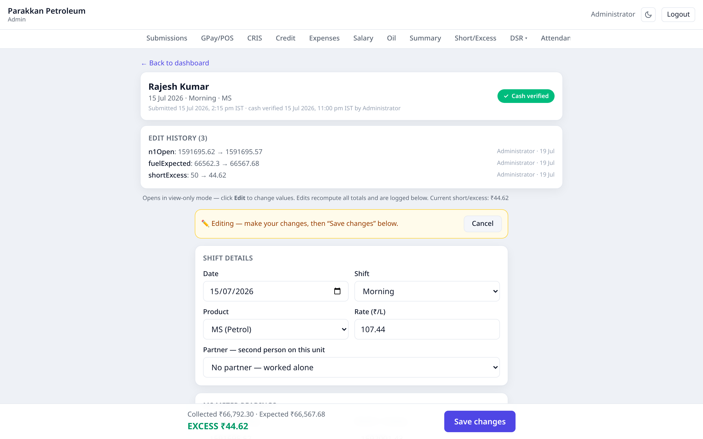
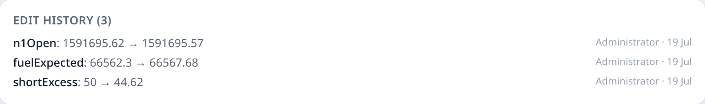
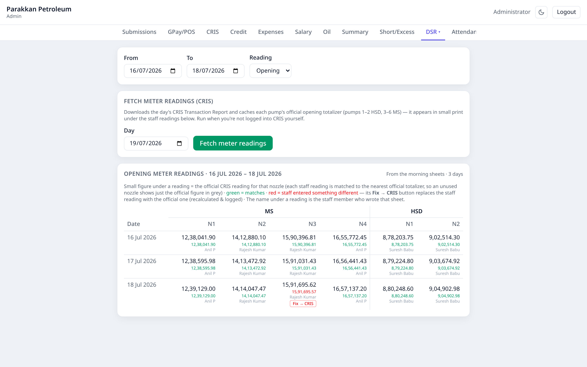
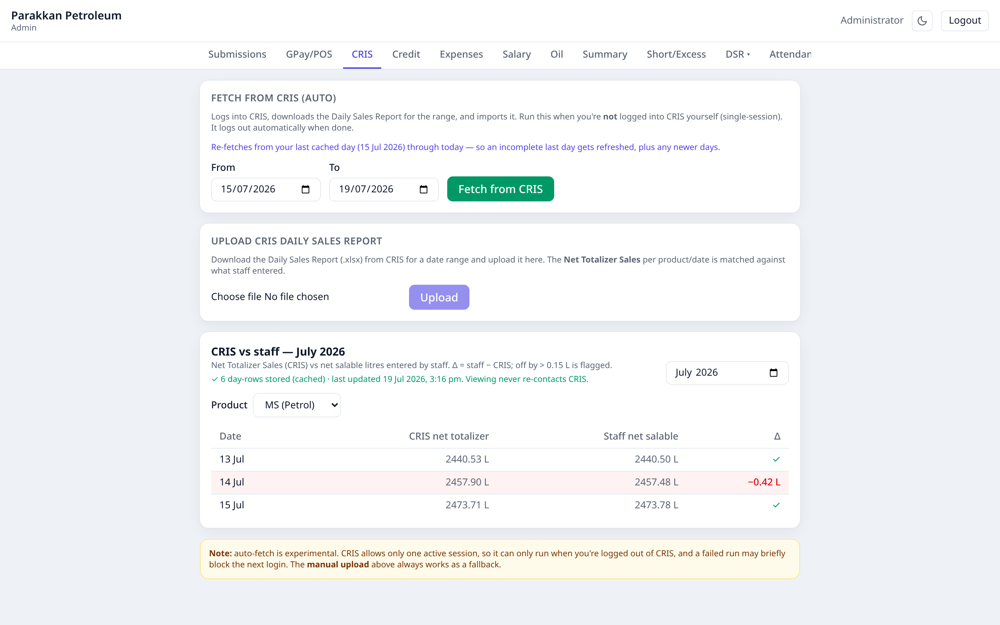
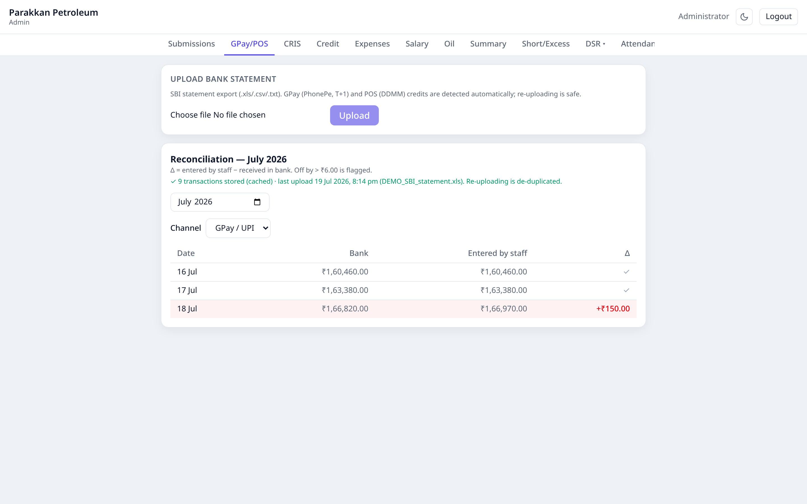
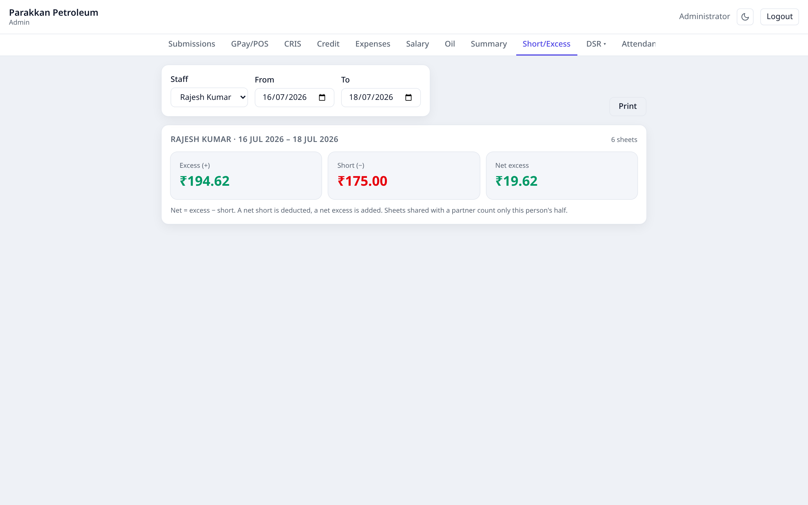
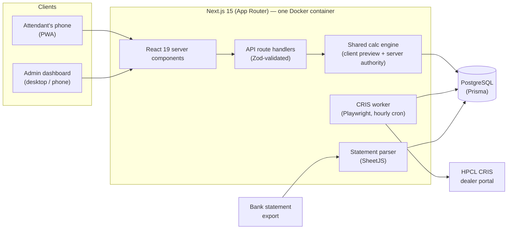

# Parakkan Petroleum — Fuel Outlet Accounting & Reconciliation

A full-stack web app that runs the daily accounting of a real HPCL (Hindustan
Petroleum) fuel outlet in Kerala, India — **in production, used every day by the
outlet's staff and management**.

It replaced a paper "Daily Collection Sheet" that pump attendants filled in by
hand at the end of every shift. Arithmetic mistakes on that sheet directly
changed people's salaries (shortages are deducted, excesses added), so errors
cost money and trust. Now staff type only what they actually measure — meter
readings and cash counted — and everything else is computed, cross-checked
against the oil company's official records and the bank statement, and audited.


<!-- HERO SHOT: admin dashboard on desktop with a date range selected and the
     submissions table visible. Use seeded/demo data — never real figures. -->


---

## What it does

**For pump attendants (mobile-first, installable PWA):**

- A digital shift sheet that mirrors the old paper layout — nozzle opening/closing
  totalizer readings, test litres, a currency-note denomination counter, GPay,
  card (POS), credit (khata) customers, 2T oil sales, and shift expenses.
- Live math as they type: gross/net litres, expected amount at today's rate, and
  the **short / excess** figure — before they hit submit.
- A partner option when two attendants share a dispensing unit: the short/excess
  is split 50/50 and attendance is marked for both.
- Submitting a sheet auto-marks attendance for that shift.

**For the owner/admin:**

- A dashboard of all submissions with date-range filtering, verification status,
  and a "needs cash verification" queue.
- Open any sheet, recount the cash, and **edit any value — every change is
  recorded in an immutable audit trail** alongside the employee's original figures.
- **CRIS reconciliation** — a headless-browser worker logs into HPCL's dealer
  portal on an hourly schedule, downloads the official Daily Sales and
  Transaction reports, and compares official per-pump totalizer readings and
  sale litres against what staff entered. Disagreements are flagged to 0.1 L,
  and a flagged meter reading gets a one-click **"Fix → CRIS"** button that
  replaces it with the official value, recomputes the sheet, and logs the change.
- **Money-received reconciliation** — one import takes the Paytm for Business
  transaction report, the bank's statement export, or both at once (each file is
  recognised by its contents). The report splits a day into GPay and POS; the
  statement supplies PhonePe money from the old QR, which Paytm never sees. A
  day's GPay is the two added together, and both are matched against the daily
  sheets with gaps flagged.
- **Month-end payroll support** — a printable per-employee short/excess
  statement (with 50/50 partner splits) that drives the salary adjustment, plus
  a salary-advance ledger and an attendance register.
- **Outlet overheads** — electricity, taxes, licence fees and the like, recorded
  against the day they belong to whenever the bill arrives. Kept strictly apart
  from till expenses: this money never passed through a shift's drawer, so it
  moves nobody's short or excess. It shows as its own itemised panel and a
  summary column for the owner and the accountant, and on its own sheet of the
  Excel export.
- Day-book style reports: monthly summary, per-employee short/excess, credit
  ledger, expense ledger, oil sales — plus dealer utilities (tank dip → litres
  chart, ASTM 3B density correction).
- Staff management with activate/deactivate (temporary-staff churn is normal at
  outlets) — past records are always preserved.

---

## Screenshots

> All screenshots use seeded demo data.

| | |
|---|---|
|  <br> **Employee shift sheet** — live totals and short/excess as they type <!-- capture on a phone-sized viewport --> |  <br> **Cash counter** — notes by denomination, totalled automatically <!-- phone viewport --> |
|  <br> **Admin review** — recount cash, edit with a full audit trail |  <br> **Audit trail** — who changed what, from what, to what |
|  <br> **Meter vs CRIS** — official totalizers in subscript, mismatches flagged red with one-click fix |  <br> **CRIS sales reconciliation** — staff litres vs the oil company's records |
|  <br> **GPay / POS reconciliation** — bank settlements matched to daily sheets |  <br> **Short/excess statement** — an employee's period totals for payroll, printable |

<!-- Regenerate all of these after a visual change with `npm run screenshots`
     (scripts/screenshots.ts — seeds a throwaway DB with demo data and drives
     headless Chrome through every page; real data is never touched). -->

---

## Architecture



Deployed on a small VPS with Docker Compose behind Caddy (automatic HTTPS);
pushes to `main` deploy via GitHub Actions.

## Engineering notes

The parts of this project I'm proudest of:

- **The server is the only calculator.** A single shared module
  ([src/lib/calc.ts](src/lib/calc.ts)) holds every money formula and its Zod
  schema. The browser imports it for live preview; the server re-runs it as the
  authority on submit and on every edit — client figures are never trusted.
  Nozzle readings are auto-normalized (opening/closing swaps are a real-world
  data-entry error), and the whole engine is unit-tested against hand-worked
  real sheets.
- **Every override is accountable.** Admins can change anything, but the
  employee's original values are never overwritten silently — each field change
  is a row in an append-only audit table, shown on the sheet itself.
- **Reverse-engineered CRIS integration.** HPCL's dealer portal has no public
  API, enforces a single active session, and serves reports as Excel downloads.
  The Playwright worker logs in, pulls both daily reports, parses them, always
  logs out (even on failure — a leaked session locks the next login), and
  deletes the downloaded files after extraction.
- **Reconciliation with real-world mess.** GPay settlements arrive T+1 through
  an aggregator and card payments arrive as bulk batch postings, so matching
  bank credits to shift sheets is fuzzy by design, with explicit tolerances and
  human-visible flags instead of silent "corrections".
- **Built for its actual users.** Attendants use it on cheap phones at a noisy
  forecourt: big touch targets, shift pre-selected by time of day, a guard
  against touchscreen ghost-clicks double-submitting, print styles for the
  reports the owner still files on paper, and filters that survive navigation.

## Data model (summary)

`User` (roles, monthly or per-shift pay) → `DailyEntry` (one attendant, one
product, one shift; raw inputs + computed snapshot + status) → child lines
(`OilLine`, `ExpenseLine`, `SalaryLine`, `CreditLine`) and `EntryAudit` (append-only
change log). `Attendance` is auto-synced from sheets. `CrisDaily` /
`CrisPumpDaily` store the portal's official figures; `BankUpload` / `BankTxn`
store parsed statement rows and their matches. `OutletExpense` /
`OutletExpenseCategory` stand apart from all of that — the outlet's own running
costs, attached to no sheet and to no till. Full schema:
[prisma/schema.prisma](prisma/schema.prisma).

## Running locally

Requires Node 18.18+ and Docker.

```bash
cp .env.example .env          # fill in the secrets
docker compose up -d          # local PostgreSQL
npm install
npx prisma migrate dev        # create schema
npm run db:seed               # demo admin + sample employees
npm run dev                   # http://localhost:3000
```

Seeded demo logins are printed by the seed script (see
[prisma/seed.ts](prisma/seed.ts)).

```bash
npm test                      # unit tests for the calc engine & parsers
```

Production deployment (VPS + Docker Compose + Caddy + GitHub Actions) is
documented in [DEPLOY.md](DEPLOY.md).

## Security

- Passwords hashed with bcrypt; signed session cookies (`jose`); role-guarded
  routes and API handlers.
- All inputs validated server-side with Zod; all money math recomputed
  server-side.
- Portal credentials live only in environment variables / encrypted at rest —
  never in the repo. Bank statements and CRIS exports (which contain customer
  phone and vehicle numbers) are git-ignored and never leave the server.

## Stack

Next.js 15 (App Router) · React 19 · TypeScript · PostgreSQL · Prisma 6 ·
Tailwind CSS 4 · Zod · SheetJS · Playwright · Vitest · Docker · Caddy ·
GitHub Actions

---

*Built for Parakkan Petroleum. The problem, the users, and the data are real —
which is exactly what made it worth building well.*
